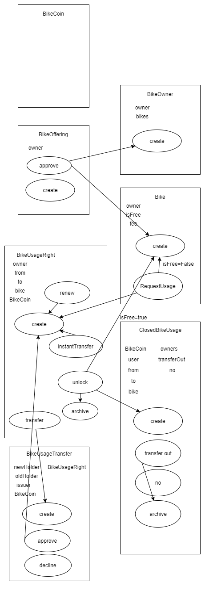
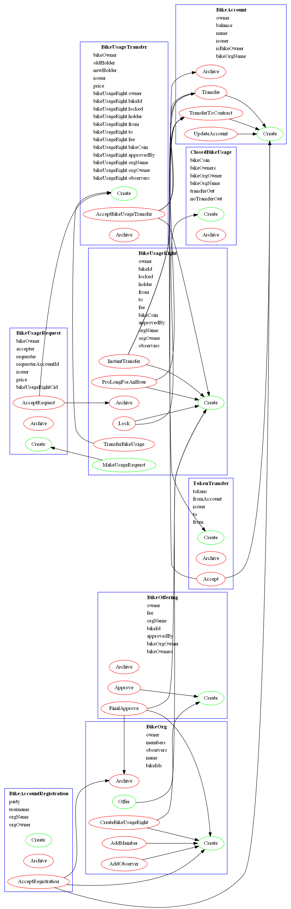

# BME_blockchain2020_homework

## Bike sharing

* Design and implement an ERC20 compliant bike usage right utility token for a university-wide bike sharing program. (If your platform is not Solidity, adapt the ERC20 specification accordingly.)
  * ERC20: https://eips.ethereum.org/EIPS/eip-20

Interface:
```d
function name() public view returns (string) //OPTIONAL
function symbol() public view returns (string) //OPTIONAL
function decimals() public view returns (uint8) //OPTIONAL

//totalSupply
//Returns the total token supply.
function totalSupply() public view returns (uint256)


//balanceOf
//Returns the account balance of another account with address _owner.
function balanceOf(address _owner) public view returns (uint256 balance)

//transfer
//Transfers _value amount of tokens to address _to, and MUST fire the Transfer event. The function SHOULD throw if the message caller’s account balance does not have enough tokens to spend.

//Note Transfers of 0 values MUST be treated as normal transfers and fire the Transfer event.

function transfer(address _to, uint256 _value) public returns (bool success)

/*transferFrom
Transfers _value amount of tokens from address _from to address _to, and MUST fire the Transfer event.

The transferFrom method is used for a withdraw workflow, allowing contracts to transfer tokens on your behalf. This can be used for example to allow a contract to transfer tokens on your behalf and/or to charge fees in sub-currencies. The function SHOULD throw unless the _from account has deliberately authorized the sender of the message via some mechanism.

Note Transfers of 0 values MUST be treated as normal transfers and fire the Transfer event.
*/
function transferFrom(address _from, address _to, uint256 _value) public returns (bool success)

/*approve
Allows _spender to withdraw from your account multiple times, up to the _value amount. If this function is called again it overwrites the current allowance with _value.

NOTE: To prevent attack vectors like the one described here and discussed here, clients SHOULD make sure to create user interfaces in such a way that they set the allowance first to 0 before setting it to another value for the same spender. THOUGH The contract itself shouldn’t enforce it, to allow backwards compatibility with contracts deployed before
*/
function approve(address _spender, uint256 _value) public returns (bool success)

/*
allowance
Returns the amount which _spender is still allowed to withdraw from _owner.
*/
function allowance(address _owner, address _spender) public view returns (uint256 remaining)

```

* New bikes get into the system by their owners registering them (requires the attestation of at least three existing bike owners); we can assume that the cooperative running the program equips registered bicycles with electronic gear locks which can monitor a distributed ledger wirelessly as well as communicate with a smart phone app over Bluetooth for periodic identity checking.

* There are two kinds of users in the system: those who are also bike owners and those who are not. Non-owners must pay a predetermined fee for the releasing party for the usage right, if she/he is an owner; otherwise, they pay “into the contract”. This unlocks the bicycle for an hour; for each additional hour of unlocking, they must pay some fee “into the contract”. Owners can get the usage right transferred to them fee-free and do not have to pay for unlocking the bicycle. Each user must have at most one bike usage right at any time; bikes that have not been used (have been being in a locked status) for 3 hours can be acquired without the original holder transferring them (the above fee scheme still applies).

* In addition to the above fee scheme, non-owners may “sell” their usage rights to non-owners for cryptocurrency (or some additionally created unit of value, if the platform is not Solidity).

* The collective of the owners may decide – by majority voting – to divide up among themselves and “transfer out” the fees collected by the contract.

### Initial plan


### System Architecture


#### BikeOrg
Stores the bikeowners and users of the BikeSharing system.
You can offer your bike to a Bike Org, if the members (bike owners) accept your request, you will be a member of the bike org. 


## Visualization
```
daml build
daml damlc visual .\.daml\dist\BikeSharing-1.0.0.dar --dot BikeSharing.dot
dot -Tpng .\BikeSharing.dot -o daml.png
```
